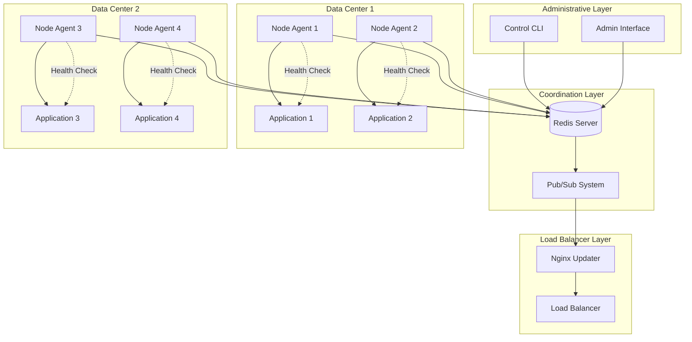
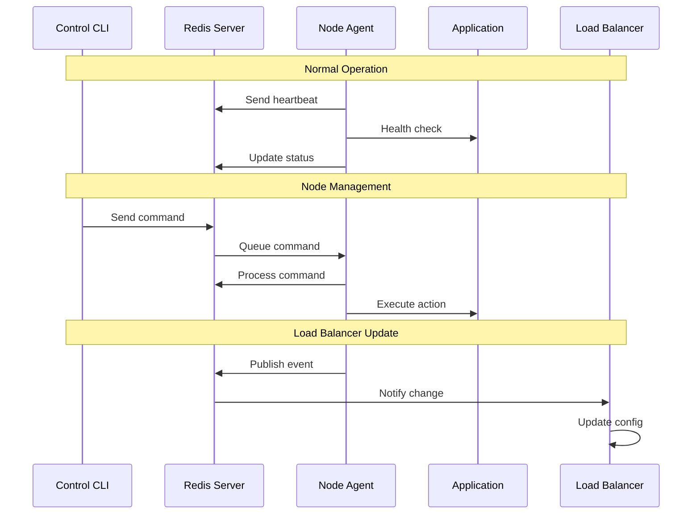
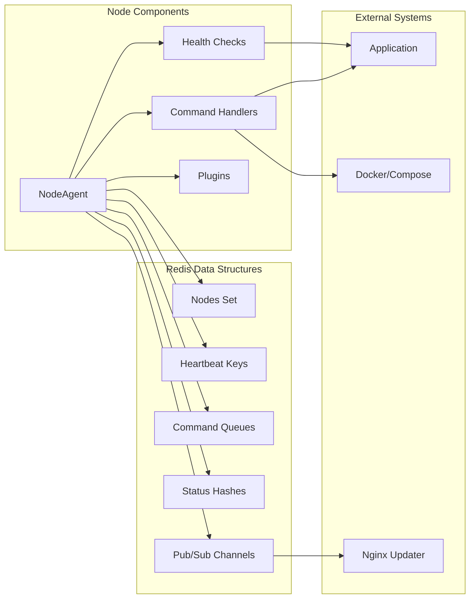
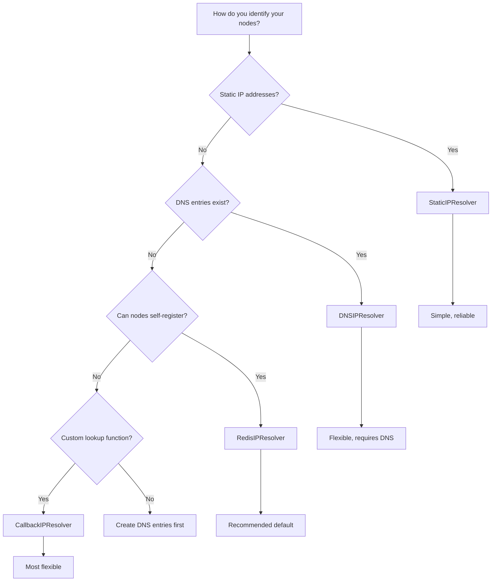
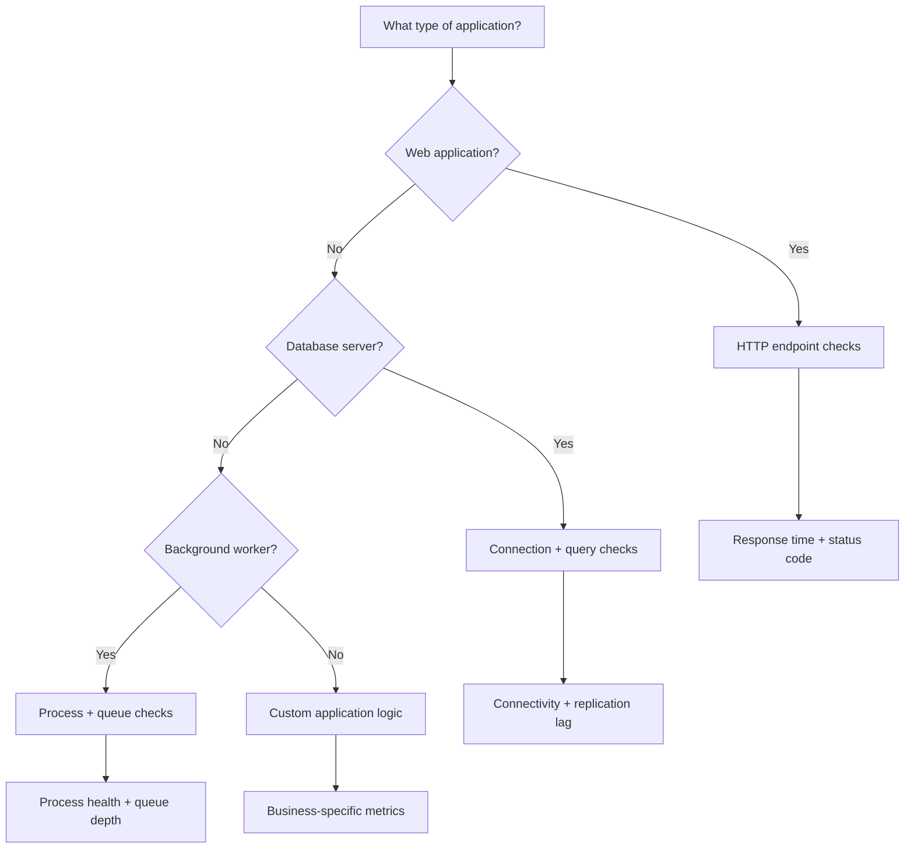
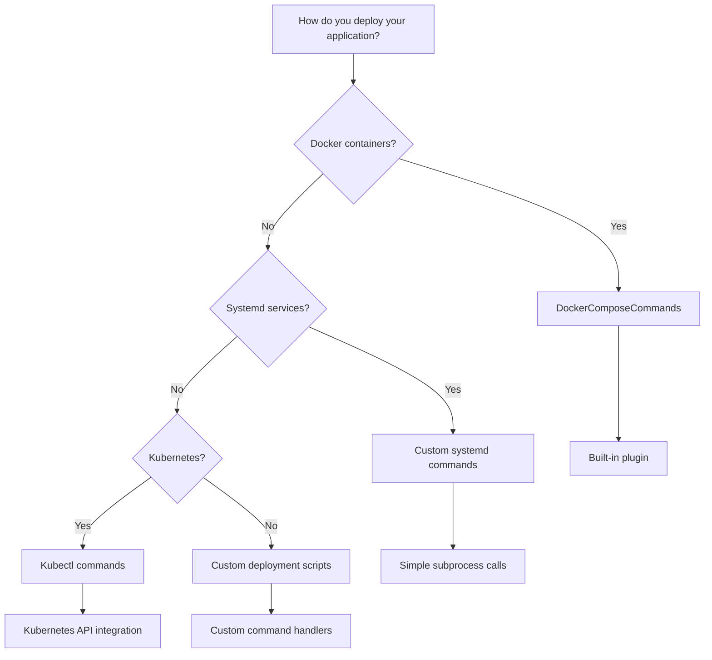
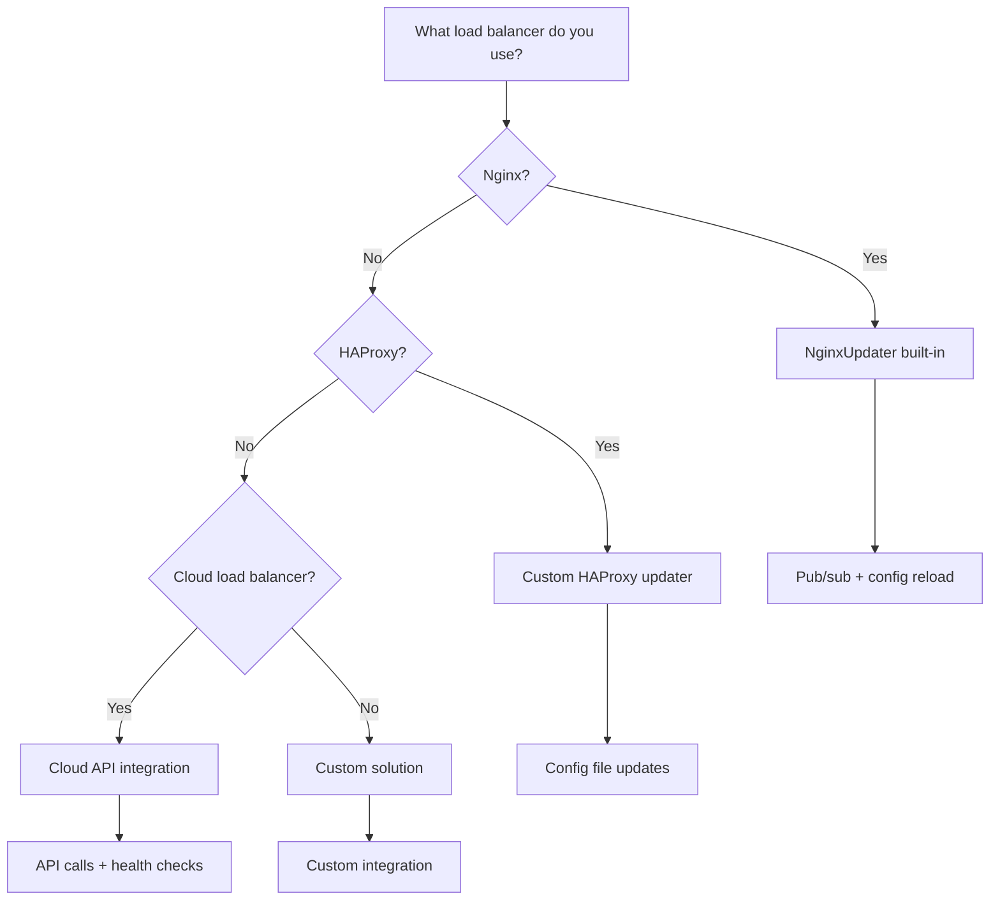

# BazBeans - Generic Multi-Node Control Plane Toolkit

## Overview

**BazBeans** is a generic, reusable control plane toolkit for orchestrating distributed FastAPI (or any) applications across multiple nodes. It provides:

- **Node self-management** - Nodes can monitor their own health and freeze/unfreeze themselves
- **Administrative control** - Central CLI to manage nodes across data centers
- **Load balancer integration** - Automatic Nginx upstream updates via Redis pub/sub
- **Pluggable architecture** - Extensible health checks, command handlers, and IP resolution strategies

## Table of Contents

- [Overview](#overview)
- [Design Principles](#design-principles)
- [Architecture Overview](#architecture-overview)
- [Decision Trees for Component Selection](#decision-trees-for-component-selection)
- [Components](#components)
- [Redis Data Model](#redis-data-model)
- [Usage Examples](#usage-examples)
- [Integration with Existing Projects](#integration-with-existing-projects)
- [Security Considerations](#security-considerations)
- [Future Enhancements](#future-enhancements)

## Design Principles

1. **Generic & Reusable** - No project-specific code; can be used across multiple projects
2. **Configuration Object** - All settings via a configuration object with sensible hardcoded defaults (no environment variable dependencies - integrators assign values as needed)
3. **Pluggable Everything** - Custom health checks, command handlers, and IP resolution strategies can be registered
4. **Event-Driven** - Redis pub/sub for real-time load balancer notifications
5. **Minimal Dependencies** - Only essential packages: redis, click, psutil

## Architecture Overview

BazBeans follows a **centralized coordination with distributed execution** pattern. The system uses Redis as a shared state backend while agents run independently on each node.

### High-Level Architecture



### Data Flow Architecture



### Component Interaction Diagram



## Components

### 1. BazBeansConfig (`config.py`)

Centralized configuration object with sensible hardcoded defaults. **No environment variables are read by BazBeans itself** - integrators are responsible for assigning values from their own configuration sources (environment variables, config files, etc.).

**Configuration Properties:**

| Property | Type | Default | Description |
|----------|------|---------|-------------|
| `redis_url` | str | `"redis://localhost:6379/0"` | Redis connection URL |
| `node_id` | str | `socket.gethostname()` | Unique node identifier |
| `data_center` | str | `"default"` | Data center identifier |
| `heartbeat_ttl` | int | `30` | Heartbeat TTL in seconds |
| `heartbeat_interval` | int | `10` | Heartbeat send interval in seconds |
| `command_poll_interval` | int | `5` | Command queue poll interval in seconds |
| `app_dir` | str | `"/opt/app"` | Application directory for docker commands |
| `compose_file` | str | `"docker-compose.yml"` | Docker compose file name |
| `pubsub_channel` | str | `"bazbeans:lb_events"` | Redis pub/sub channel for LB events |
| `cpu_threshold` | int | `90` | CPU % threshold for auto-freeze |
| `memory_threshold` | int | `85` | Memory % threshold for auto-freeze |
| `node_port` | int | `8000` | Port the application listens on |
| `allowed_exec_prefixes` | list | `["docker", "systemctl", "ls", "cat"]` | Whitelist for exec command |

**Usage Example:**
```python
from bazbeans import BazBeansConfig

# Create config with defaults
config = BazBeansConfig()

# Override specific values (integrator's responsibility)
config.redis_url = os.environ.get("MY_REDIS_URL", config.redis_url)
config.node_id = sanitize_node_id(os.environ.get("MY_NODE_NAME", config.node_id))
config.heartbeat_ttl = 60  # Custom TTL

# Or create with overrides
config = BazBeansConfig(
    redis_url="redis://my-redis:6379/0",
    node_id="dc1_server01",
    data_center="dc1"
)
```

### 2. NodePool (`node_pool.py`)

Manages the shared state of all nodes in Redis.

**Redis Keys:**
- `bazbeans:nodes:all` - Set of all registered node IDs
- `bazbeans:nodes:active` - Set of currently active node IDs
- `bazbeans:node:{node_id}:heartbeat` - Heartbeat data with TTL
- `bazbeans:node:{node_id}:status` - Node status hash
- `bazbeans:node:{node_id}:commands` - Command queue (list)

**Key Methods:**
```python
class NodePool:
    def register(self) -> None
    def heartbeat(self, metrics: dict) -> None
    def freeze(self, reason: str) -> None
    def unfreeze(self) -> None
    def get_active_nodes(self) -> List[str]
    def get_all_nodes(self) -> List[str]
    def get_node_status(self, node_id: str) -> dict
    def cleanup_dead_nodes(self) -> List[str]
```

### 3. NodeAgent (`node_agent.py`)

The agent that runs on each node, handling:
- Periodic heartbeats with system metrics
- Self-health monitoring with configurable thresholds
- Command queue processing
- Pub/sub notifications to load balancer
- **Pluggable command handlers** for extensibility

**Pluggable Health Checks:**
```python
agent = NodeAgent(config)

# Register custom health check
@agent.health_check
def check_database_connection():
    # Return True if healthy, False to trigger freeze
    return db.is_connected()

# Register custom command handler
@agent.command_handler("custom_action")
def handle_custom_action(command: dict) -> dict:
    # Process command and return result
    return {"status": "completed"}
```

**Core Commands (always available):**
- `freeze` - Remove node from active pool
- `unfreeze` - Add node back to active pool
- `exec` - Execute shell command (with whitelist)
- `deploy_file` - Deploy file content to path
- `health_check` - Run health check and report

**Pluggable Service Commands:**

Docker-compose commands are provided as an **example plugin** that can be enabled or replaced:

```python
from bazbeans import NodeAgent, DockerComposeCommands

agent = NodeAgent(config)

# Option 1: Use the built-in docker-compose command plugin
agent.register_command_plugin(DockerComposeCommands(config))

# Option 2: Register your own service commands
@agent.command_handler("start")
def custom_start(command: dict) -> dict:
    # Your custom start logic (systemd, kubernetes, etc.)
    subprocess.run(["systemctl", "start", "myapp"])
    return {"status": "started"}

@agent.command_handler("stop")
def custom_stop(command: dict) -> dict:
    subprocess.run(["systemctl", "stop", "myapp"])
    return {"status": "stopped"}
```

**DockerComposeCommands Plugin (example implementation):**
```python
class DockerComposeCommands:
    """Example plugin providing docker-compose service management."""
    
    def __init__(self, config: BazBeansConfig):
        self.app_dir = config.app_dir
        self.compose_file = config.compose_file
    
    def get_handlers(self) -> dict:
        return {
            "start": self._cmd_start,
            "stop": self._cmd_stop,
            "restart": self._cmd_restart,
            "update": self._cmd_update,
        }
    
    def _cmd_start(self, command: dict) -> dict:
        result = subprocess.run(
            ["docker-compose", "-f", self.compose_file, "up", "-d"],
            cwd=self.app_dir, capture_output=True, text=True
        )
        return {"stdout": result.stdout, "stderr": result.stderr}
    
    # ... other methods
```

### 4. ControlCLI (`control_cli.py`)

Administrative command-line interface for cluster management.

**Commands:**
```bash
# List all nodes with status
bazbeans list-nodes

# Node control
bazbeans freeze <node_id> [--reason "maintenance"]
bazbeans unfreeze <node_id>
bazbeans start <node_id>
bazbeans stop <node_id>
bazbeans restart <node_id>

# Cluster-wide operations
bazbeans update [--dc <datacenter>]  # Rolling update
bazbeans exec <node_id> "docker ps"

# File deployment
bazbeans deploy-file <node_id> <local_file> <remote_path>

# Status
bazbeans status <node_id>
```

### 5. PubSub (`pubsub.py`)

Redis pub/sub system for real-time load balancer notifications.

**Events Published:**
```python
{
    "event": "node_frozen" | "node_unfrozen" | "node_registered" | "node_removed",
    "node_id": "dc1_hostname",
    "timestamp": "2024-01-15T10:30:00Z",
    "reason": "High CPU usage",  # optional
    "active_nodes": ["node1", "node2", ...]  # current active list
}
```

**Publisher (in NodeAgent):**
```python
def _notify_load_balancer(self, action: str, reason: str = ""):
    event = {
        "event": f"node_{action}",
        "node_id": self.node_id,
        "timestamp": datetime.utcnow().isoformat(),
        "reason": reason,
        "active_nodes": self.pool.get_active_nodes()
    }
    self.redis.publish(self.config.pubsub_channel, json.dumps(event))
```

### 6. NginxUpdater (`nginx_updater.py`)

Subscribes to pub/sub channel and updates Nginx upstream configuration.

**Features:**
- Subscribes to `bazbeans:lb_events` channel
- **Pluggable IP resolution** with multiple strategies and fallback support
- Generates upstream configuration
- Reloads Nginx on changes

**IP Resolution Strategies:**

BazBeans supports multiple IP resolution strategies with primary/fallback configuration:

```python
from bazbeans.nginx_updater import (
    NginxUpdater,
    RedisIPResolver,      # Nodes self-register their IPs
    CallbackIPResolver,   # Custom callback function
    DNSIPResolver,        # DNS lookup
    StaticIPResolver,     # Static mapping (for testing/demo)
    ChainedIPResolver,    # Primary + fallback chain
)

# Strategy 1: Redis self-registration (default, recommended)
# Nodes register their IP when they start
resolver = RedisIPResolver(redis_client)

# Strategy 2: Custom callback
resolver = CallbackIPResolver(
    callback=lambda node_id: my_lookup_function(node_id)
)

# Strategy 3: DNS lookup
resolver = DNSIPResolver(
    domain_suffix=".internal.mycompany.com"  # node_id + suffix
)

# Strategy 4: Static mapping (for testing)
resolver = StaticIPResolver({
    "dc1_server01": "10.0.1.10",
    "dc1_server02": "10.0.1.11",
})

# Strategy 5: Chained with fallback
resolver = ChainedIPResolver(
    primary=RedisIPResolver(redis_client),
    fallback=StaticIPResolver({"dc1_server01": "10.0.1.10"})
)
```

**Node Self-Registration (for RedisIPResolver):**

When using `RedisIPResolver`, nodes automatically register their IP address:

```python
# In NodeAgent, during registration:
def register(self):
    # ... existing registration ...
    
    # Self-register IP for load balancer resolution
    my_ip = self._detect_ip()  # Auto-detect or from config
    self.redis.hset("bazbeans:node_ips", self.node_id, my_ip)
```

**NginxUpdater Configuration:**
```python
updater = NginxUpdater(
    config=BazBeansConfig(redis_url="redis://localhost:6379"),
    upstream_name="app_backend",
    upstream_file="/etc/nginx/conf.d/upstream.conf",
    ip_resolver=ChainedIPResolver(
        primary=RedisIPResolver(redis_client),
        fallback=StaticIPResolver(emergency_fallback_ips)
    )
)
updater.run()  # Blocking - listens for events
```

## File Structure

```
bazbeans/
├── __init__.py          # Public API exports
├── config.py            # BazBeansConfig class
├── node_pool.py         # NodePool class
├── node_agent.py        # NodeAgent class
├── control_cli.py       # Click-based CLI
├── pubsub.py            # Pub/sub utilities
├── nginx_updater.py     # Nginx integration
├── requirements.txt     # Dependencies
├── ARCHITECTURE.md      # This document
└── README.md            # Usage documentation
```

## Usage Examples

### Running a Node Agent (Basic)

```python
from bazbeans import BazBeansConfig, NodeAgent

# Create config with defaults
config = BazBeansConfig()

# Override from your own configuration source
import os
config.redis_url = os.environ.get("MY_REDIS_URL", config.redis_url)
config.node_id = os.environ.get("MY_NODE_ID", config.node_id)

# Create and run agent
agent = NodeAgent(config)
agent.run()  # Blocking
```

### Running a Node Agent (With Plugins)

```python
from bazbeans import BazBeansConfig, NodeAgent, DockerComposeCommands

config = BazBeansConfig()
config.redis_url = "redis://my-redis:6379/0"
config.node_id = "dc1_webserver01"
config.app_dir = "/opt/myapp"

agent = NodeAgent(config)

# Register docker-compose command plugin
agent.register_command_plugin(DockerComposeCommands(config))

# Add custom health check
@agent.health_check
def check_app_health():
    import requests
    try:
        r = requests.get("http://localhost:8000/health", timeout=5)
        return r.status_code == 200
    except:
        return False

# Add custom command
@agent.command_handler("clear_cache")
def clear_cache(command: dict) -> dict:
    # Custom logic
    return {"status": "cache_cleared"}

agent.run()
```

### Using the Control CLI

```bash
# The CLI reads config from a simple config object
# You can set values via command-line options

# List nodes
python -m bazbeans.control_cli --redis-url "redis://my-redis:6379" list-nodes

# Freeze a node
python -m bazbeans.control_cli --redis-url "redis://my-redis:6379" freeze dc1_server01 --reason "Maintenance"

# Rolling update across datacenter
python -m bazbeans.control_cli --redis-url "redis://my-redis:6379" update --dc dc1
```

### Running Nginx Updater

```python
from bazbeans import BazBeansConfig, NginxUpdater
from bazbeans.nginx_updater import RedisIPResolver, StaticIPResolver, ChainedIPResolver

config = BazBeansConfig()
config.redis_url = "redis://my-redis:6379/0"

# Create IP resolver with fallback
import redis
redis_client = redis.Redis.from_url(config.redis_url)

resolver = ChainedIPResolver(
    primary=RedisIPResolver(redis_client),
    fallback=StaticIPResolver({
        "dc1_server01": "10.0.1.10",  # Emergency fallback
        "dc1_server02": "10.0.1.11",
    })
)

updater = NginxUpdater(
    config=config,
    upstream_name="app_backend",
    upstream_file="/etc/nginx/conf.d/upstream.conf",
    ip_resolver=resolver
)
updater.run()  # Blocking - listens for pub/sub events
```

## Decision Trees for Component Selection

### 🎯 Choosing Your IP Resolution Strategy



**Recommendations:**
- **Development/Testing:** `StaticIPResolver` - Easiest to set up
- **Single Datacenter:** `RedisIPResolver` - Most reliable
- **Multiple Datacenters:** `ChainedIPResolver` with fallback
- **Cloud Environment:** `DNSIPResolver` or `CallbackIPResolver`

### 🎯 Choosing Health Check Strategy



### 🎯 Choosing Command Plugin Strategy



### 🎯 Choosing Load Balancer Integration



## Integration with Existing Projects

BazBeans is designed to be integrated without modifying existing application code:

1. **Install BazBeans** in your project (`pip install bazbeans` or copy the package)
2. **Create a configuration script** that sets up `BazBeansConfig` with your values
3. **Run NodeAgent** as a separate process (systemd service, supervisor, etc.)
4. **Run NginxUpdater** on your load balancer server
5. **Use ControlCLI** for administrative tasks

**Example Integration Script (`run_agent.py`):**
```python
#!/usr/bin/env python3
"""
Project-specific BazBeans agent runner.
This is where you map your project's configuration to BazBeans.
"""
import os
import re
from bazbeans import BazBeansConfig, NodeAgent, DockerComposeCommands

def sanitize_node_id(value: str) -> str:
    """Remove characters not allowed in Redis keys."""
    return re.sub(r'[^a-zA-Z0-9_-]', '_', value)

# Create config and map from your environment
config = BazBeansConfig()

# Map your project's env vars to BazBeans config
config.redis_url = os.environ.get("REDIS_BACKEND", config.redis_url)
config.node_id = sanitize_node_id(
    os.environ.get("INTERNET_DNS_HOST", config.node_id)
)
config.data_center = os.environ.get("DATA_CENTER", "default")
config.app_dir = os.environ.get("APP_DIR", "/opt/myapp")

# Create agent with docker-compose support
agent = NodeAgent(config)
agent.register_command_plugin(DockerComposeCommands(config))

# Add project-specific health checks
@agent.health_check
def check_api_health():
    import requests
    try:
        port = os.environ.get("API_PORT", "8000")
        r = requests.get(f"http://localhost:{port}/health", timeout=5)
        return r.status_code == 200
    except:
        return False

if __name__ == "__main__":
    agent.run()
```

The agent runs alongside your application, monitoring health and responding to commands, without requiring any changes to your FastAPI/application code.

## Security Considerations

1. **Command Whitelist** - The `exec` command only allows whitelisted command prefixes
2. **Redis Authentication** - Use Redis AUTH and TLS in production
3. **File Deployment** - Validate paths to prevent directory traversal
4. **Network Isolation** - Redis should be on internal network only

## Future Enhancements

- [ ] Web UI dashboard for cluster visualization
- [ ] Prometheus metrics endpoint
- [ ] Slack/Discord notifications
- [ ] Automatic scaling triggers
- [ ] Multi-cluster support
- [ ] Encrypted command payloads