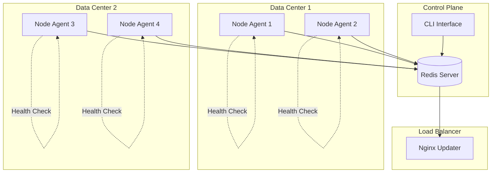

# BazBeans - Generic Multi-Node Control Plane Toolkit

> **Orchestrate distributed applications with ease** - A reusable toolkit for managing multi-node deployments with automatic health monitoring, load balancer integration, and centralized control.

## 🎯 What is BazBeans?

BazBeans is a **generic control plane toolkit** that helps you manage distributed applications across multiple servers. Think of it as the "operating system" for your cluster - it handles the hard parts of distributed coordination so you can focus on your application.

> **BETA** : This project is new. Use at your own risk. We're developing the framework and it's early days.  We're using it for our own project(s), but would not recommend using in production without testing and a fallback plan.  I mean... we are using it, but don't necessarily do as we do.  Or try it, you may love it.   :-)

> **macOS** : The proejct

### 🚀 Key Capabilities

- **🏥 Self-Healing Nodes** - Nodes monitor their own health and automatically remove themselves from the load balancer when unhealthy
- **🎛️ Centralized Control** - Manage your entire cluster from a simple command-line interface
- **⚡ Auto Load Balancing** - Automatic Nginx upstream updates via Redis pub/sub
- **🔌 Pluggable Architecture** - Add custom health checks, commands, and IP resolution strategies
- **🔄 Zero Project Coupling** - Generic design works with any application stack
- **🚀 One-Click CLI Installation** - Auto-installs OS-specific CLI when you `pip install bazbeans`

## 🛤️ Choose Your Path (30 seconds)

### 🎮 **I want to manage existing nodes**
**Goal:** Control and monitor a running cluster
**Start:** [CLI Setup Guide](SETUP-CLI.md) → 5-minute setup

### 🤖 **I want to deploy new agents**
**Goal:** Add BazBeans agents to my applications
**Start:** [Agent Deployment Guide](AGENT-DEPLOYMENT.md) → Production-ready setup

### ⚡ **I want to try it right now**
**Goal:** Quick test on my local machine
**Start:** [Quick Start Guide](QUICK-START.md) → 5-minute working demo

### 📚 **I want to understand how it works**
**Goal:** Learn the architecture and concepts
**Start:** [Architecture Guide](ARCHITECTURE.md) → Deep dive

---

## 🚀 Quick Start (5 minutes)

Get a working cluster in under 5 minutes:

```bash
# 1. Start Redis
redis-server

# 2. Install BazBeans
pip install bazbeans

# The CLI is automatically installed for your OS!
# You can start using 'bazbeans' commands immediately

# 3. Run a test agent
python -c "
from bazbeans import BazBeansConfig, NodeAgent
config = BazBeansConfig(redis_url='redis://localhost:6379/0', node_id='test-node')
NodeAgent(config).run()
" &

# 4. Manage your cluster
bazbeans list-nodes
bazbeans status test-node
```

> **⚠️ Note:** For production deployment, see the [Agent Deployment Guide](AGENT-DEPLOYMENT.md)

---

## 🏗️ Architecture Overview



### Core Components

| Component | Purpose | Key Features |
|-----------|---------|--------------|
| **NodeAgent** | Runs on each server | Health monitoring, command handling, self-management |
| **ControlCLI** | Administrative interface | Cluster management, node control, file deployment |
| **NginxUpdater** | Load balancer integration | Automatic upstream updates, IP resolution |
| **NodePool** | Redis state management | Heartbeats, status tracking, command queues |

---

## 🎯 Use Cases

### 🌐 Web Application Clusters
```python
# Perfect for FastAPI, Django, Flask applications
# Automatic health checks and load balancer updates
# Rolling updates with zero downtime
```

### 📦 Microservices Management
```python
# Manage containerized services
# Docker-compose integration included
# Custom health checks per service
```

### 🔄 Background Job Processing
```python
# Monitor Celery, RQ, or custom job queues
# Auto-freeze unhealthy workers
# Centralized job queue management
```

### 🏢 Enterprise Applications
```python
# Multi-datacenter deployments
# Custom command handlers for business logic
# Integration with existing monitoring systems
```

---

## 🛠️ Configuration Examples

### Basic Web Server Setup
```python
from bazbeans import BazBeansConfig, NodeAgent, DockerComposeCommands

config = BazBeansConfig(
    redis_url="redis://cluster-redis:6379/0",
    node_id="web-server-01",
    data_center="us-east-1",
    node_port=8000,
    cpu_threshold=85,
    memory_threshold=80
)

agent = NodeAgent(config)
agent.register_command_plugin(DockerComposeCommands(config))

# Add web-specific health check
@agent.health_check
def check_web_health():
    import requests
    return requests.get("http://localhost:8000/health").status_code == 200

agent.run()
```

### Database Server Setup
```python
config = BazBeansConfig(
    redis_url="redis://cluster-redis:6379/0",
    node_id="db-server-01",
    data_center="us-east-1",
    cpu_threshold=95,  # Higher threshold for databases
    memory_threshold=90
)

agent = NodeAgent(config)

# Add database-specific health checks
@agent.health_check
def check_database():
    # Your database connection logic
    return database.is_connected()

@agent.health_check
def check_replication():
    # Check replication lag
    return database.replication_lag() < 10

agent.run()
```

---

## 🎮 CLI Commands

### Node Management
```bash
# List all nodes with health status
bazbeans list-nodes

# Get detailed node information
bazbeans status web-server-01

# Freeze a node (remove from load balancer)
bazbeans freeze web-server-01 --reason "maintenance"

# Unfreeze a node
bazbeans unfreeze web-server-01
```

### Service Control
```bash
# Start services on a node
bazbeans start web-server-01

# Stop services
bazbeans stop web-server-01

# Restart services
bazbeans restart web-server-01

# Rolling update across datacenter
bazbeans update --dc us-east-1
```

### Operations
```bash
# Execute commands on nodes
bazbeans exec web-server-01 "docker ps"

# Deploy files to nodes
bazbeans deploy-file web-server-01 ./config.yaml /opt/app/config.yaml

# Clean up dead nodes
bazbeans cleanup
```

---

## 🔌 Extensibility

### Custom Health Checks
```python
@agent.health_check
def check_custom_service():
    """Check if your custom service is healthy."""
    try:
        # Your health check logic
        return service.ping()
    except:
        return False

@agent.health_check
def check_disk_space():
    """Custom disk space check."""
    import psutil
    return psutil.disk_usage('/app').percent < 95
```

### Custom Command Handlers
```python
@agent.command_handler("backup")
def handle_backup(command):
    """Handle backup commands."""
    # Your backup logic
    return {"status": "backup_started", "timestamp": time.time()}

@agent.command_handler("custom_action")
def handle_custom(command):
    """Handle custom business logic."""
    # Your custom logic
    return {"status": "completed", "result": "success"}
```

### IP Resolution Strategies
```python
from bazbeans.ip_resolvers import (
    RedisIPResolver,      # Nodes self-register IPs
    DNSIPResolver,        # DNS lookup
    StaticIPResolver,     # Static mapping
    ChainedIPResolver     # Primary + fallback
)

# Choose your strategy
resolver = ChainedIPResolver(
    primary=RedisIPResolver(redis_client),
    fallback=StaticIPResolver({"emergency-ip": "10.0.1.100"})
)
```

---

## 📊 System Requirements

### Minimum Requirements
- **Python:** 3.8 or higher
- **Memory:** 512MB per node
- **Disk:** 100MB free space
- **Network:** Port 6379 (Redis) accessible

### Recommended for Production
- **Python:** 3.9+ with virtual environment
- **Memory:** 1GB+ per node
- **Redis:** Dedicated server with persistence
- **Network:** Private network or VPN
- **Security:** Redis AUTH + TLS

### Platform Support
- ✅ Linux (Ubuntu, CentOS, Debian)
- ✅ macOS (development only)
- ✅ Windows (development only)
- ✅ Docker containers
- ✅ Kubernetes (with custom setup)

---

## 🔒 Security Considerations

### Redis Security
```bash
# Enable Redis authentication
requirepass your-secure-password

# Use TLS in production
tls-port 6380
tls-cert-file /path/to/redis.crt
tls-key-file /path/to/redis.key

# Network isolation
bind 10.0.1.10 127.0.0.1
```

### Agent Security
```python
# Run as non-root user
# Use virtual environments
# Validate file paths
# Whitelist allowed commands
config.allowed_exec_prefixes = ["docker", "systemctl", "ls"]
```

### Network Security
- Use VPN or private networks
- Implement firewall rules
- Monitor for unauthorized access
- Regular security audits

---

## 📚 Documentation

### Getting Started
- **[Quick Start Guide](QUICK-START.md)** - 5-minute setup
- **[Auto-Installation Guide](AUTO-INSTALLATION.md)** - CLI auto-install details
- **[CLI Setup Guide](SETUP-CLI.md)** - Manual CLI installation
- **[Agent Deployment Guide](AGENT-DEPLOYMENT.md)** - Production deployment

### Advanced Topics
- **[Architecture Guide](ARCHITECTURE.md)** - System design and components
- **[Troubleshooting Guide](TROUBLESHOOTING.md)** - Common issues and solutions
- **[Examples](examples/)** - Integration patterns and samples

### Reference
- **[Configuration Reference](#configuration)** - All configuration options
- **[CLI Command Reference](#cli-commands)** - Complete command list
- **[API Documentation](README.md#advanced-usage)** - Programmatic usage

---

## 🆘 Getting Help

### Self-Service
- **[Troubleshooting Guide](TROUBLESHOOTING.md)** - Step-by-step problem solving
- **[FAQ](docs/FAQ.md)** - Common questions
- **[Examples](examples/)** - Working code samples

### Community
- **GitHub Issues** - Bug reports and feature requests
- **Discussions** - Questions and best practices
- **Wiki** - Community-contributed content

### Enterprise Support
- Priority support channels
- Custom integration assistance
- Architecture consulting
- Training sessions

---

## 🤝 Contributing

We welcome contributions! See our [Contributing Guide](CONTRIBUTING.md) for details.

### Quick Contribution Steps
1. Fork the repository
2. Create a feature branch
3. Make your changes
4. Add tests if applicable
5. Submit a pull request

---

## 📄 License

This toolkit is designed to be generic and reusable across projects. Please adapt and extend as needed for your specific use case.

---

## 🎉 Release Notes

### v0.1.1 - Auto-Installation Feature

**🚀 New: One-Click CLI Installation**

- **Automatic CLI Installation**: When you run `pip install bazbeans`, the OS-specific CLI is now automatically installed
- **Cross-Platform Support**: Works seamlessly on Linux, macOS, and Windows
- **Smart OS Detection**: Automatically chooses the right installer for your platform
- **Error Handling**: Graceful fallbacks if installation fails - Python package still works
- **Skip Options**: Multiple ways to skip auto-installation if needed

**🛠️ Improvements**

- Enhanced setup experience with automatic PATH configuration
- Clear installation progress messages
- Comprehensive troubleshooting documentation
- Manual installation options still available

**📚 Documentation**

- New [Auto-Installation Guide](AUTO-INSTALLATION.md) with detailed information
- Updated [CLI Setup Guide](SETUP-CLI.md) with auto-installation notes
- Improved README with auto-installation highlights

**🔧 Technical Details**

- Custom setuptools commands for integration
- Post-installation hooks for seamless installation
- Environment variable controls for customization
- Non-blocking installation that doesn't affect Python package functionality

### What's Next

- Enhanced cross-platform compatibility testing
- Additional CLI command improvements
- More integration examples and patterns

---

## 🎯 Next Steps

1. **New Users:** Start with [Quick Start Guide](QUICK-START.md)
2. **Production Setup:** Read [Agent Deployment Guide](AGENT-DEPLOYMENT.md)
3. **Custom Integration:** See [Examples](examples/) folder
4. **Deep Understanding:** Review [Architecture Guide](ARCHITECTURE.md)

---

**⏱️ Time to First Value:** 5 minutes with Quick Start  
**🎯 Primary Goal:** Simplify distributed application management  
**🔧 Approach:** Generic, pluggable, production-ready toolkit